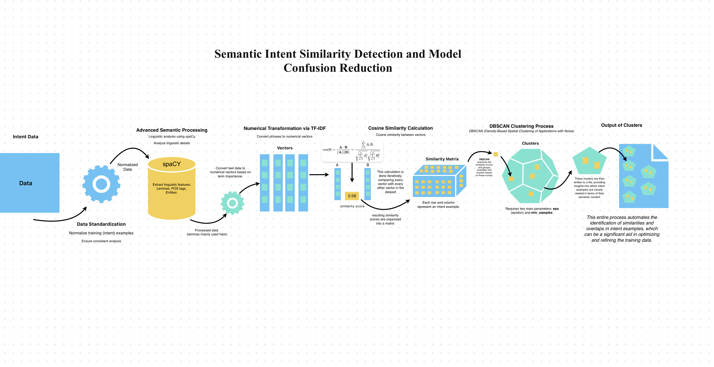

# Intent Cluster Analysis

## Semantic Intent Similarity Detection and Model Confusion Reduction

This repository contains the process and code for clustering intent examples based on their semantic similarity. The aim is to group similar intent examples together to reduce model confusion and improve intent detection accuracy.

## Process Overview

The following diagram illustrates the overall process of semantic intent similarity detection and model confusion reduction:

### Steps

1. **Data Standardization**:
   - Normalize training examples to ensure consistent analysis.
   
2. **Advanced Semantic Processing**:
   - Extract linguistic features using `spaCy` such as lemmas, parts of speech (POS), and named entities.
   
3. **Numerical Transformation via TF-IDF**:
   - Convert text data into numerical vectors based on term importance.
   
4. **Cosine Similarity Calculation**:
   - Calculate the cosine similarity between vectors to generate a similarity matrix.
   
5. **DBSCAN Clustering Process**:
   - Cluster intent examples using DBSCAN (Density-Based Spatial Clustering of Applications with Noise).
   
6. **Output of Clusters**:
   - Group similar intent examples together, providing insights into which examples are closely related in terms of their semantic content.